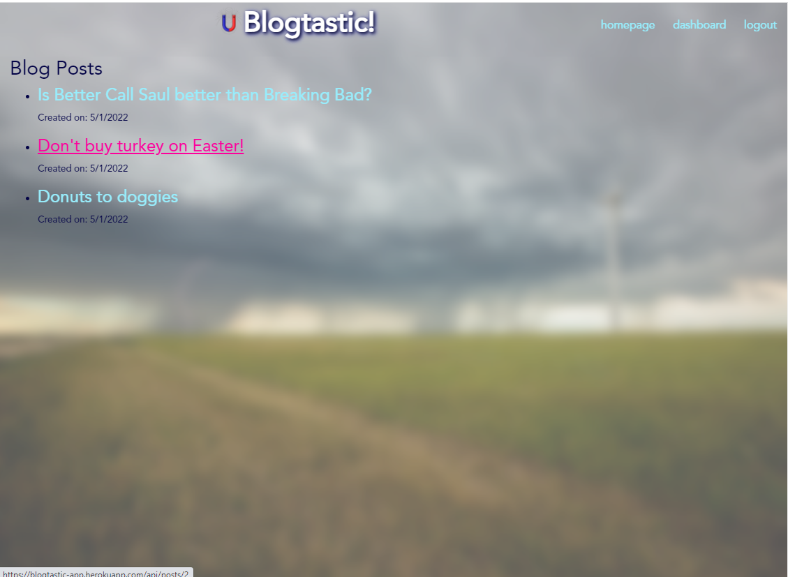

# Blogtastic
## An application by H0RSESH0E  
&nbsp;  
  
&nbsp;&nbsp;  
## Table of Contents
#### [Description](#description)  -  [Installation](#installation)  -  [Usage](#usage) - [License](#license) - [Contributing](#contributing) - [Tests](#tests) - [Questions](#questions)
&nbsp;  
## Description  
This Full Stack application creates a CMS-style blog site following the Model View Controller (MVC) paradigm.  It utilizes several node package manager modules including: Handlebars.js, Sequelize, MySQL2, Express, Express-session and bcrypt.  
&nbsp;  
    
     
&nbsp;  
## Installation
To install the website, run "source db/schema.sql" from the mysql comand promtp, "npm i" from the applications' root directory followed by "node server".  
&nbsp;  
## Usage
Please use the blog site to share thoughts and opinions with honesty, consideration and care.  
&nbsp;  
## License  

**MIT License**  
A short and simple permissive license with conditions only requiring preservation of copyright and license notices. Licensed works, modifications, and larger works may be distributed under different terms and without source code.  
[View the full license here.](./LICENSE/license.txt)  
&nbsp;  
## Contributing
There are no guidelines as this project is not being maintained.  Please fork and respect the terms of the license.  
&nbsp;  
## Tests
N/A  
&nbsp;  
## Questions
Questions or concerns about the project or how to contribute to its development can be emailed to: **dcpb777@gmail.com**  
&nbsp;  
&nbsp;  
  
  
**[Visit me on GitHub](https://github.com/H0RSESH0E)**  
